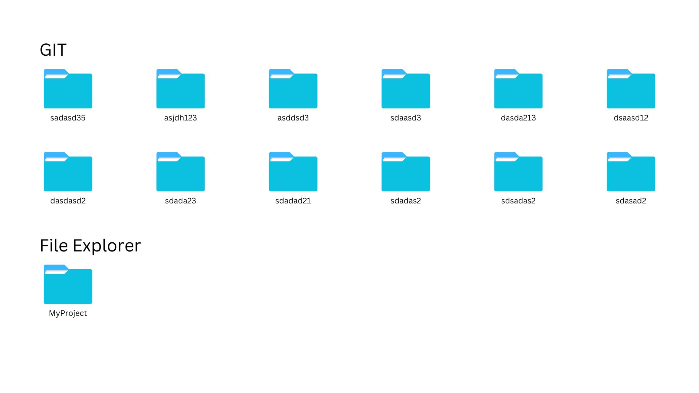
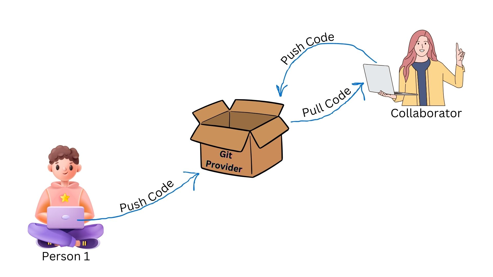

# Git Essentials🚂

In this tutorial, I will be discussing how to start using Git. This tutorial references multiple platforms and books that I have read. Follow along with the instructions to master Git. So, let's get started.

### Table of Contents

The contents of the tutorial are divided as follows:

1. [Why use Git?](#why-use-git)
2. [How does Git work?](#how-does-git-work)
3. [Install and configure Git](#install-and-configure-git)
4. [Push your code with Git](#push-your-code-with-git)
5. [Make changes to files](#make-changes-to-files)
6. [Important concepts in Git](#important-concepts-in-git)

### Why Use Git?

#### Version Control

One of the main reason of using git is for version control. A version control system can be used to track the changes in the code.
Let's take a senario where we have multiple versions of our project in our local storage.

In above example, I have seperate folders of all the changed codes as versions of my project. It is very hard to maintain and stresses me out😖.

Using git just simplifies the process. We can change the code and create separate versions of our code/project as commit which is stored in the git locally or remotely. Then we can access the dififerent versions of our project. lets take a visual representation of what I have just said🤯.

Can git be used only locally? What will happen if my hard disk is damaged? What if I lost my computer?

For these types of situations we can use **Git Provider .** By using git provider we can store the projects both locally and on the cloud too.

#### To Share Code

What if more than one person is working on a project or take instance of 10 people working on the same project.

Let's assume one person makes changes now the changes must be synced with all other people codebase. What can you do in these kind of situations?

Well the first answer comes to my mind is **_I WOULD USE GIT_**. Using git provider we will be able to share the codes with our team easily.

#### To Colaborate
