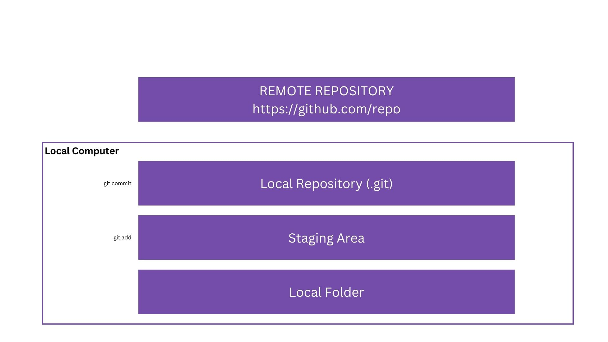
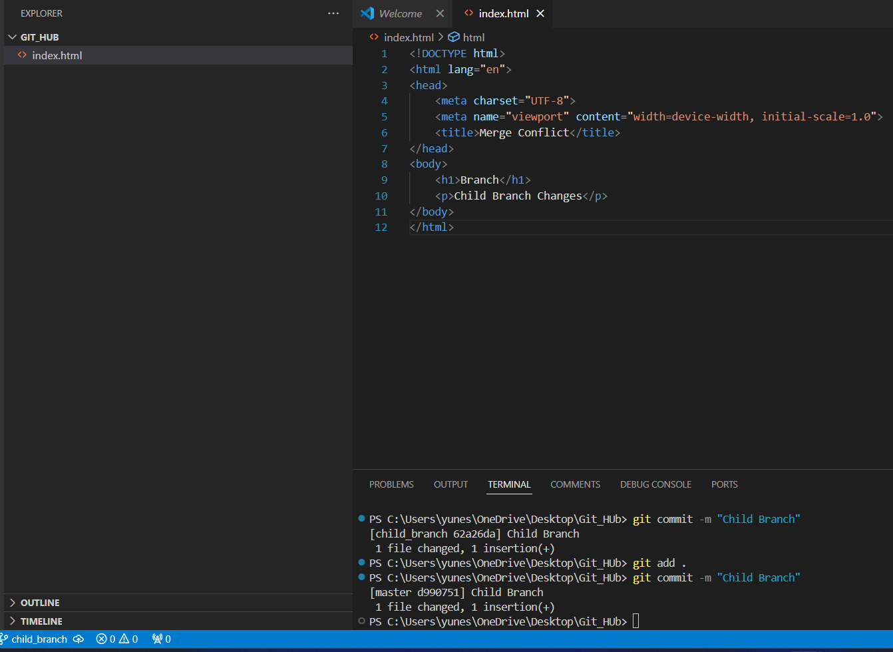
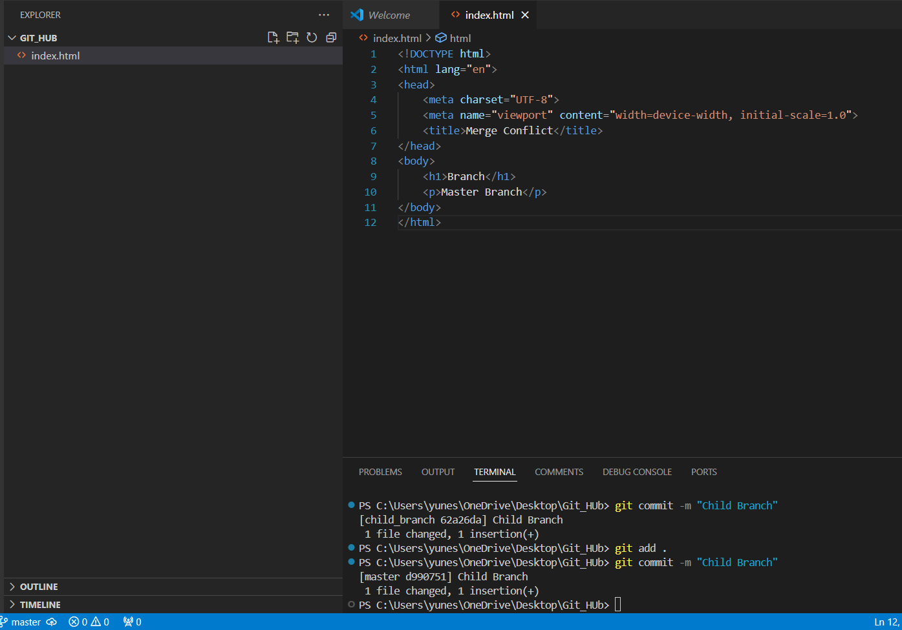

## 🚀 Git Essentials 🚀

Welcome to the Git Essentials tutorial! Here, you'll learn how to start using Git effectively. This guide references multiple platforms and books, providing step-by-step instructions to master Git. Ready to dive in? Let's get started! 🚂

### 📚 Table of Contents

1. [Why Use Git?](#why-use-git)
2. [How Does Git Work?](#how-does-git-work)
3. [Install and Configure Git](#install-and-configure-git)
4. [Push Your Code with Git](#push-your-code-with-git)
5. [Make Changes to Files](#make-changes-to-files)
6. [Important Concepts in Git](#important-concepts-in-git)

### 🤔 Why Use Git?

#### Version Control

One of the main reasons to use Git is for version control. It helps you track changes in your code. Imagine having multiple versions of your project stored locally. It can get messy and stressful! 😖

Using Git simplifies this process. You can change the code and create separate versions as commits, stored locally or remotely. This way, you can access different versions of your project easily. Let's visualize this! 🤯


Can Git be used only locally? What if my hard disk is damaged or I lose my computer? 

For these situations, you can use a **Git Provider** to store your projects both locally and on the cloud.

#### To Share Code

Working with a team? Git makes it easy to sync changes among multiple collaborators. 🌍


Using a Git provider, you can share code with your team effortlessly.

#### To Collaborate

Git is great for collaboration. Multiple people can work on the same project by being added as collaborators. Git providers establish remote connections for easy code sharing. Git can even merge different codes automatically, though sometimes you'll need to do it manually. 🤝

#### Open Source

Open Source means the code is publicly available. You can download, modify, create your version, and publish it. A community often works on open source projects, detecting bugs, fixing them, and improving the code. Git features like branches make open source contributions easy.

### ⚙️ How Does Git Work?

Let's explore the technical side of Git. We'll learn how to use Git locally, use Git providers, and understand distributed version control.

#### Using Git Locally

When using Git locally, there are three stages: 
1. **Working Directory**: Where you make changes.
2. **Staging Area**: Use `git add <filename>` to stage changes.
3. **Local Repository**: Use `git commit` to save changes.



#### Using a Git Provider

With a Git provider, use `git push` to upload changes to a remote repository and `git pull` to download changes.

#### Distributed Version Control

In distributed version control, every client has a complete copy of the repository, including all files, snapshots, and history. If something happens to the central repository, each client still has a full copy.

### 🛠️ Install and Configure Git

#### Downloading

Start by installing Git for your OS from [Git Downloads](https://git-scm.com/downloads).

#### Installation

Installing Git is straightforward. Follow the prompts and install it.

#### Configuration

Configure Git using the `gitconfig` file. Important config files include:
- **Global**: `~/.gitconfig` or `C:\Users\[user]\.gitconfig`
- **Local**: `.git/config`

Local settings can overwrite global settings.

#### Showing the Configuration

Type `git config --list` in the terminal to view the configuration.

**Setting up global configurations**:
- **Username**: `git config --global user.name "Your_name"`
- **Email**: `git config --global user.email "name@example.com"`

### 📤 Push Your Code with Git

Learn to create a new repository and work with it. We'll use **GitHub** as our Git provider.

#### Setting Up a Remote Repo

1. Sign up and visit [GitHub](https://github.com/new).
2. Name your repository, choose visibility, add a README, and get started.

#### Cloning the Remote Repository

1. Open the GitHub repo.
2. Click on the green "Code" dropdown and copy the HTTPS URL.
3. In your terminal, type:
    ```bash
    git clone <HTTPS URL>
    cd <repo-name>
    code .
    ```

#### Creating a File and Staging It

1. Create and save a file.
2. Stage the file:
    ```bash
    git add <filename>
    git status
    git commit -m "first commit"
    git status
    ```

#### Pushing File to Remote Repo

1. Push the changes:
    ```bash
    git push
    ```
2. Check the GitHub repo to confirm the changes.

#### The `.git` Folder

The `.git` folder is the heart of your Git repository. It contains all the metadata and object data Git needs to manage the version history.

**Structure of the `.git` Folder**:
- **config**: Configuration settings.
- **HEAD**: Points to the current branch reference.
- **index**: Stores staging area information.
- **logs/**: Contains logs of reference updates.
- **objects/**: Stores all objects (blobs, trees, commits).
- **refs/**: Contains references to commit objects.
- **hooks/**: Contains scripts triggered by Git actions.

### 🔧 Make Changes to Files

#### Introduction to `git status`

The `git status` command provides an overview of your working directory and staging area. It helps track changes and understand your repository's state.

**Typical Output**:
```plaintext
On branch main
Your branch is up to date with 'origin/main'.

Changes to be committed:
  (use "git restore --staged <file>..." to unstage)
    modified:   file1.txt
    new file:   file2.txt

Changes not staged for commit:
  (use "git add <file>..." to update what will be committed)
  (use "git restore <file>..." to discard changes in working directory)
    modified:   file3.txt

Untracked files:
  (use "git add <file>..." to include in what will be committed)
    file4.txt
```

#### Introduction to `git diff`

The `git diff` command shows the differences between various states of your repository.

**Basic Usage**:
- Compare working directory to staging area: `git diff`
- Compare staging area to last commit: `git diff --cached`
- Compare specific file: `git diff <file>`
- Compare two commits: `git diff <commit1> <commit2>`

**Example Output**:
```plaintext
diff --git a/file1.txt b/file1.txt
index d3ff2c6..f7c3f58 100644
--- a/file1.txt
+++ b/file1.txt
@@ -1,3 +1,4 @@
 Line 1
 Line 2
+New line 3
 Line 4
```

#### Introduction to `git log`

The `git log` command displays commit history, including commit hash, author, date, and message.

**Basic Usage**:
- View commit details: `git show <commit-hash>`
- Search for specific commits: `git log --grep='your_commit'`

#### Renaming a File

Rename a file with Git using:
```bash
git mv current_name new_name
```

#### Working with Folders

Git doesn't track empty folders by default. To track an empty folder, create a `.gitkeep` file inside it.

#### Undoing Changes

**Undo staged changes**:
1. Stage a file: `git add example.txt`
2. Check status: `git status`
3. Unstage the file: `git restore --staged example.txt`
4. Verify: `git status`

**Undo changes to a file**:
1. Modify a file: `example.txt`
2. Check status: `git status`
3. Revert changes: `git restore example.txt`

#### Looking Back in History

Use `git log` to view commit history. To go back to a specific commit:
```bash
git checkout <commit-hash>
```
To return to the latest version:
```bash
git checkout main
```

#### Reverting to an Old Change

Revert to a previous commit:
```bash
git log --oneline
git revert <commit-id>
```

### 📌 Important Concepts in Git

#### Ignoring Files

Use a `.gitignore` file to exclude specific files or folders from being tracked by Git.

Example `.gitignore` entry:
```plaintext
example.md
```

#### Git Branches

Branches allow you to work on different features or fixes in isolation.

**Key Commands**:
- Create a branch: `git branch <branch-name>`
- Switch to a branch: `git switch <branch-name>`
- Create and switch to a new branch: `git switch -c <branch-name>`
- List all branches: `git branch`
- Merge a branch: `git merge <branch-name>`
- Delete a branch: `git branch -d <branch-name>`

#### Good Commit Messages

Good commit messages should:
- Describe changes precisely
- Use present tense
- Be concise (max 50 characters)
- Include additional details if necessary

#### Merge Conflicts

Merge conflicts occur when changes from different branches conflict. Carefully review and resolve conflicts to ensure a smooth merge.

##### Steps to Reproduce Merge Conflict

1. **Create a Project and Initialize Git:**
   - Create a new project directory.
   - Add an `index.html` file to the project.
   - Initialize Git in the project directory and add the file to the local repository:

     ```bash
     git init
     git add index.html
     git commit -m "Initial commit with index.html"
     ```

2. **Create a New Branch from `master` (or any current branch `c1`):**
   - Create a new branch named `child_branch`:

     ```bash
     git branch child_branch
     ```

3. **Switch to `child_branch`:**
   - Checkout the `child_branch`:

     ```bash
     git checkout child_branch
     ```

4. **Make Changes in `child_branch` and Commit:**
   - Make any changes to the `index.html` file in the `child_branch`.
   - Commit the changes:

     ```bash
     git add index.html
     git commit -m "Changes made to index.html in child_branch"
     ```
     
   

5. **Make Changes in `master` Branch and Commit:**
   - Switch back to the `master` branch:

     ```bash
     git checkout master
     ```

   - Make any changes to the `index.html` file in the `master` branch.
   - Commit the changes:

     ```bash
     git add index.html
     git commit -m "Changes made to index.html in master branch"
     ```

     
    

## Result

When you try to merge `child_branch` back into the `master` branch, a merge conflict will occur because both branches have made changes to the same file, `index.html`.

---

Congratulations! You've reached the end of the Git Essentials
